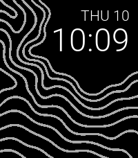

# Topographic — Pebble Time 2

Topographic is a clean, customizable watchface where time meets terrain.

It pairs an uncluttered digital clock with flowing contour lines inspired by
hillside maps. The landscape naturally frames the time, keeping it easy to read
while giving the face a distinctive outdoor character.



## Features

- Place the date and time in any of the four corners.
- Automatically reorient the topographic design to match the chosen layout.
- Choose separate colors for the background, contour lines, and text.
- Select from four date-and-time font styles.
- Use the Pebble's preferred 12- or 24-hour time format.

Designed specifically for the 200 × 228 display of Pebble Time 2. No account,
location access, or network connection is required.

## Install

Download `Topographic Watchface.pbw` from the latest release and sideload it
through the Pebble mobile app or install it with Pebble Tool:

```sh
pebble install "Topographic Watchface.pbw"
```

## Build

```sh
pebble build
```

The installable file is generated at `build/Topographic Watchface.pbw`.

To run it in the Time 2 emulator:

```sh
pebble install --emulator emery
```

Open the settings page in the emulator with:

```sh
pebble emu-app-config --emulator emery
```
